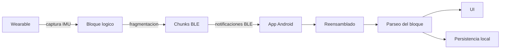
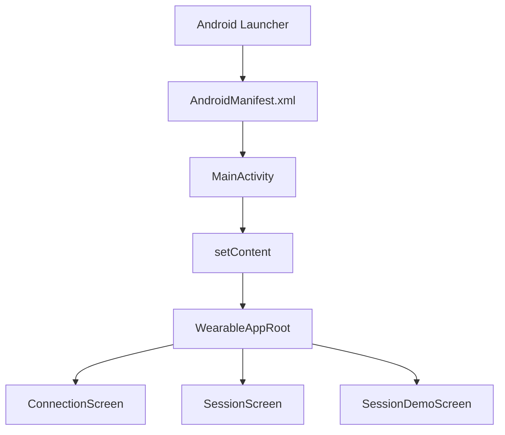
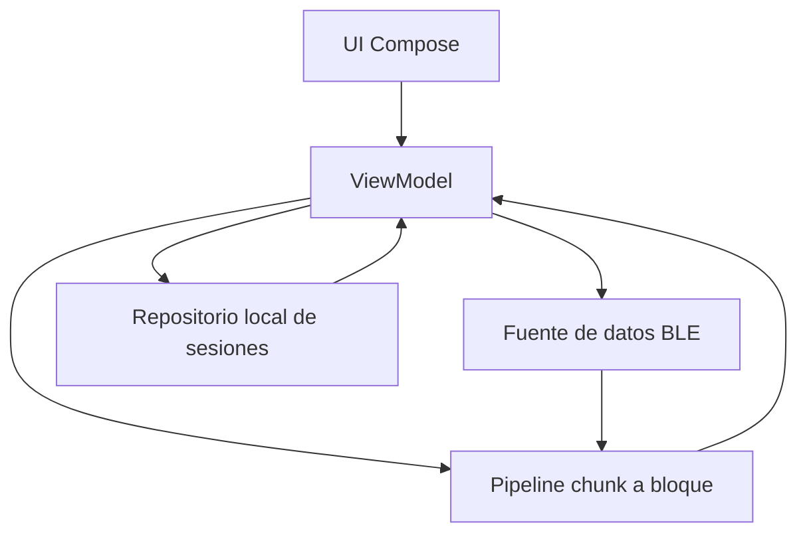
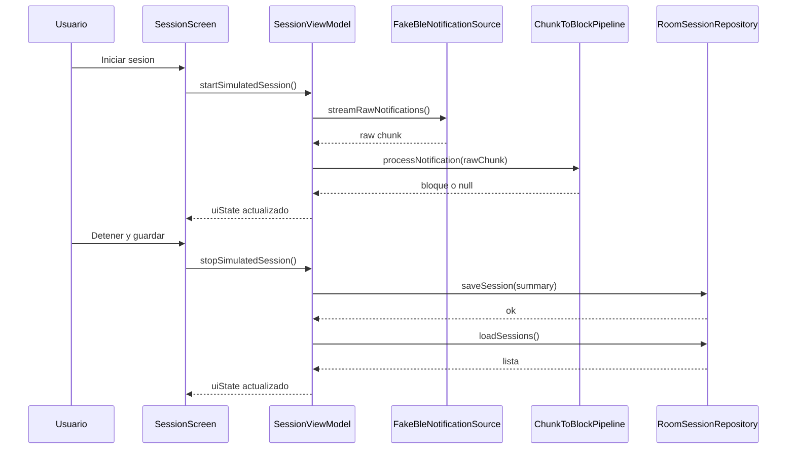
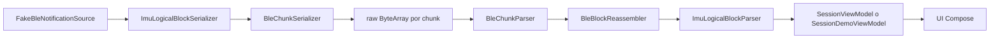
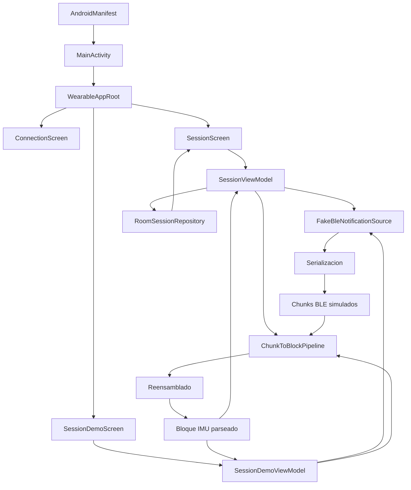

# Pizarra de aprendizaje de la app Android

## Objetivo de esta pizarra

Esta pizarra sirve para entender el proyecto de forma modular y poder explicarlo con seguridad:

- que se construyo
- por que se construyo asi
- como arranca la app
- como viajan los datos
- que hace cada archivo importante
- en que punto del MVP estamos

## 1. Idea global del sistema

El sistema completo tiene dos nodos:

1. `wearable`
2. `app Android`

El wearable captura datos IMU y los envia por BLE.

La app Android:

- controla la sesion
- recibe chunks BLE
- recompone bloques logicos
- extrae datos utiles
- muestra estado en pantalla
- guarda sesiones en `Room`
- se orienta a dashboard post-sesion

## BLE real - primer corte

Objetivo de esta fase:

- descubrir la XIAO
- conectar
- negociar MTU
- recibir notificaciones
- detectar desconexion

Arquitectura:

```text
XIAO smoke test
-> app pantalla Conexion
-> scan BLE
-> connectGatt
-> requestMtu
-> enable notifications
-> mostrar bytes recibidos
```

Todavia no:

- no se mete IMU real
- no se mete chunking final de firmware
- no se conecta aun a Session/Room/dashboard productivo



## 2. Como nacio el proyecto

El orden real del trabajo fue aproximadamente este:

1. Se leyo el alcance del TFG y se fijo que la primera app seria `Android`.
2. Se eligio `Kotlin + Android nativo + Jetpack Compose`.
3. Se documento la arquitectura y el protocolo BLE antes de programar demasiado.
4. Se creo primero la capa de transporte BLE en Kotlin.
5. Se construyo despues el scaffold Android.
6. Se conecto una simulacion local para no depender todavia del wearable real.
7. Se separo la app en flujo principal y demo tecnica interna.
8. Se anadio persistencia local minima de sesiones simuladas.
9. Se introdujo `Room` para persistencia estructurada de sesiones.
10. Se decidio priorizar dashboard post-sesion frente a dashboard completo en tiempo real.
11. Se anadio un `PostSessionProcessor` para empezar a transformar el CSV crudo en metricas utiles.

## 3. Estructura grande del repositorio

La zona importante para esta app es:

```text
app/
  README.md
  docs/
    architecture.md
    ble-protocol-v1.md
    ble-transport-v1-concrete.md
    mvp-scope.md
    roadmap.md
    tfg-dev-log.md
  mobile-android/
    settings.gradle.kts
    build.gradle.kts
    app/
      build.gradle.kts
      src/main/
        AndroidManifest.xml
        java/com/tfg/wearableapp/
```

## 4. Mapa modular de carpetas y archivos

### 4.1. Documentacion

Archivos para entender decisiones:

- `app/README.md`: decision principal del stack y enfoque del MVP
- `app/docs/architecture.md`: arquitectura por capas y flujo ideal del sistema
- `app/docs/ble-protocol-v1.md`: contrato conceptual BLE
- `app/docs/ble-transport-v1-concrete.md`: diseno numerico concreto del transporte
- `app/docs/mvp-scope.md`: que entra y que no entra en el MVP
- `app/docs/roadmap.md`: orden recomendado de desarrollo
- `app/docs/tfg-dev-log.md`: bitacora de como fue avanzando el proyecto

### 4.2. Configuracion Android y Gradle

Archivos que hacen que el proyecto exista y compile:

- `app/mobile-android/settings.gradle.kts`: define repositorios y el modulo `:app`
- `app/mobile-android/build.gradle.kts`: declara plugins base de Android y Kotlin
- `app/mobile-android/app/build.gradle.kts`: configura la app real
- `app/mobile-android/app/src/main/AndroidManifest.xml`: permisos BLE y actividad de entrada

### 4.3. Punto de entrada y raiz visual

Archivos que arrancan la app:

- `MainActivity.kt`
- `app/WearableAppRoot.kt`

### 4.4. Features de interfaz

Pantallas y estado:

- `feature/connection/ConnectionScreen.kt`
- `feature/session/SessionScreen.kt`
- `feature/session/SessionUiState.kt`
- `feature/session/SessionViewModel.kt`
- `feature/session/SessionDemoScreen.kt`
- `feature/session/SessionDemoUiState.kt`
- `feature/session/SessionDemoViewModel.kt`

### 4.5. Nucleo BLE

Codigo independiente de Android visual:

- `core/ble/BleTransportConfig.kt`
- `core/ble/BleMtuMath.kt`
- `core/ble/model/*`
- `core/ble/parser/*`
- `core/ble/reassembly/BleBlockReassembler.kt`
- `core/ble/pipeline/ChunkToBlockPipeline.kt`
- `core/ble/serializer/*`

### 4.6. Capa de datos

Fuentes de datos y persistencia:

- `data/ble/FakeBleNotificationSource.kt`
- `data/ble/RealBleClientSkeleton.kt`
- `data/local/AppDatabase.kt`
- `data/local/session/SessionEntity.kt`
- `data/local/session/SessionDao.kt`
- `data/session/RoomSessionRepository.kt`
- `data/session/StoredSessionSummary.kt`

## 5. Como se lanza todo

## Nivel 1: Android abre la app

Cuando tocas el icono de la app:

1. Android lee `AndroidManifest.xml`.
2. Ve que la actividad principal es `MainActivity`.
3. Ejecuta `MainActivity.onCreate(...)`.
4. `MainActivity` llama a `setContent { ... }`.
5. Compose dibuja la UI empezando por `WearableAppRoot(...)`.



## Nivel 2: Gradle hace que compile

Para construir la app:

1. `settings.gradle.kts` registra el proyecto y el modulo `:app`.
2. `build.gradle.kts` del nivel raiz carga plugins de Android y Kotlin.
3. `app/build.gradle.kts` define:
   - `namespace`
   - `applicationId`
   - `minSdk`
   - `targetSdk`
   - soporte `Compose`
   - dependencias de `lifecycle`, `coroutines` y `material3`

## 6. Arquitectura real que teneis ahora

No es todavia una arquitectura por capas completa con `domain` y navegacion formal.
Lo que teneis ahora es un MVP funcional con esta separacion:



Lectura practica:

- `UI` pinta pantallas
- `ViewModel` coordina
- `core/ble` hace trabajo tecnico puro
- `data/ble` simula o preparara BLE real
- `data/session` persiste sesiones con `Room`
- `data/processing` empieza a convertir datos crudos en resultados post-sesion

## 7. Pantallas actuales de la app

### Conexion

Pantalla: `feature/connection/ConnectionScreen.kt`

Que representa:

- el flujo futuro de conexion BLE real
- los permisos ya definidos
- los siguientes pasos tecnicos

No conecta todavia de verdad.
Es una pantalla de producto y orientacion del MVP.

### Sesion

Pantalla: `feature/session/SessionScreen.kt`

Que hace:

- iniciar una sesion simulada
- mostrar contadores
- detenerla
- guardar un resumen local
- listar sesiones guardadas

Esta es la pantalla funcional principal del MVP actual.

### Demo tecnica

Pantalla: `feature/session/SessionDemoScreen.kt`

Que hace:

- enseña el transporte BLE de forma tecnica
- deja probar la simulacion
- muestra MTU, chunks y bloques
- prepara el modo futuro de BLE real

Esta pantalla no es tanto de producto como de validacion tecnica.

## 8. Navegacion actual

No hay un sistema de navegacion con rutas.
La app usa una navegacion simple basada en estado.

Archivo clave: `app/WearableAppRoot.kt`

Tiene un enum interno:

- `Connection`
- `Session`
- `Debug`

Y cambia de pantalla con un `when`.

Eso significa que:

- es sencillo
- sirve para el MVP
- mas adelante se podria migrar a `Navigation Compose`

## 9. Que hace MainActivity exactamente

Archivo: `MainActivity.kt`

Responsabilidades:

1. crea el `SessionViewModel`
2. crea el `SessionDemoViewModel`
3. observa sus `uiState`
4. pasa estados y callbacks a `WearableAppRoot`

Idea importante para explicar:

`MainActivity` no contiene la logica de negocio.
Solo monta la app y conecta piezas.

## 10. El flujo funcional de sesion

Cuando pulsas `Iniciar sesion`:

1. `SessionScreen` llama a `onStartSimulatedSession`
2. eso llega a `SessionViewModel.startSimulatedSession()`
3. el `ViewModel` crea una sesion activa
4. se suscribe a la fuente fake BLE
5. cada notificacion se manda al pipeline
6. si un bloque se completa, se actualizan metricas
7. la UI refleja los cambios automaticamente

Cuando pulsas `Detener y guardar`:

1. se cancela el flujo
2. se construye un `StoredSessionSummary`
3. se guarda con `RoomSessionRepository`
4. se recargan las sesiones guardadas
5. la lista aparece en pantalla



## 11. El flujo tecnico BLE simulado

Este es uno de los puntos mas importantes para entender el proyecto.

### Paso 1. Generacion del bloque logico

Archivo: `data/ble/FakeBleNotificationSource.kt`

Hace esto:

- genera muestras IMU sinteticas
- construye un `ImuLogicalBlock`
- usa senales matematicas para simular movimiento

### Paso 2. Serializacion del bloque

Archivo: `core/ble/serializer/ImuLogicalBlockSerializer.kt`

Convierte el bloque Kotlin a `ByteArray`.

### Paso 3. Fragmentacion en chunks BLE

Archivo: `core/ble/serializer/BleChunkSerializer.kt`

Divide el bloque completo en varios chunks:

- cada chunk tiene cabecera propia
- cada chunk transporta un trozo del bloque

### Paso 4. Emision como si fueran notificaciones BLE

La `FakeBleNotificationSource` va emitiendo cada `ByteArray` con retrasos simulados.

### Paso 5. Parseo del chunk entrante

Archivo: `core/ble/parser/BleChunkParser.kt`

Lee:

- `protocolVersion`
- `packetId`
- `chunkIndex`
- `chunkCount`
- `payloadSize`
- `payload`

### Paso 6. Reensamblado del bloque

Archivo: `core/ble/reassembly/BleBlockReassembler.kt`

Hace esto:

- guarda cada chunk por `packetId`
- coloca cada payload en su posicion
- cuando estan todos, concatena
- si tarda demasiado, descarta el bloque incompleto

### Paso 7. Parseo del bloque logico ya completo

Archivo: `core/ble/parser/ImuLogicalBlockParser.kt`

Convierte el bloque binario otra vez a un objeto Kotlin con:

- cabecera
- muestras IMU
- metadatos

### Paso 8. Publicacion a la UI

El `ViewModel` actualiza su `uiState` y Compose redibuja.



## 12. Archivo por archivo: que idea representa cada uno

### Configuracion y arranque

- `settings.gradle.kts`: dice que existe el modulo `app`
- `build.gradle.kts`: activa plugins base
- `app/build.gradle.kts`: define como compila la app
- `AndroidManifest.xml`: permisos BLE y actividad de entrada
- `MainActivity.kt`: primer punto de entrada Kotlin

### Raiz de interfaz

- `WearableAppRoot.kt`: contenedor principal con barra superior, barra inferior y cambio de seccion

### Conexion

- `ConnectionScreen.kt`: explica el estado del MVP y el flujo BLE real futuro

### Sesion funcional

- `SessionUiState.kt`: estado que pinta la pantalla de sesion
- `SessionViewModel.kt`: coordina sesion simulada, metricas y guardado
- `SessionScreen.kt`: pinta controles, metricas y lista de sesiones

### Demo tecnica

- `SessionDemoUiState.kt`: estado de la demo tecnica
- `SessionDemoViewModel.kt`: ejecuta simulacion de transporte BLE
- `SessionDemoScreen.kt`: enseña contadores de chunks, bloques y MTU

### Datos BLE

- `FakeBleNotificationSource.kt`: finge un wearable enviando notificaciones
- `RealBleClientSkeleton.kt`: esqueleto para el futuro `BluetoothGattCallback`

### Persistencia

- `StoredSessionSummary.kt`: modelo de resumen de sesion guardada
- `AppDatabase.kt`: base de datos principal
- `SessionEntity.kt`: entidad persistente de sesion
- `SessionDao.kt`: acceso a datos de sesion
- `RoomSessionRepository.kt`: repositorio actual de sesiones

### Transporte BLE

- `BleTransportConfig.kt`: constantes de protocolo
- `BleMtuMath.kt`: calculo del payload disponible segun MTU
- `BleChunk.kt`: modelo de chunk
- `ImuLogicalBlock.kt`: modelo de bloque logico
- `ImuSample.kt`: modelo de una muestra IMU
- `ChunkTransportStats.kt`: contadores tecnicos
- `ReassemblyStatus.kt`: estados del reensamblado
- `BleChunkParser.kt`: parser del chunk
- `ImuLogicalBlockParser.kt`: parser del bloque
- `BleBlockReassembler.kt`: junta chunks por `packetId`
- `ChunkToBlockPipeline.kt`: orquesta parseo y reensamblado
- `BleChunkSerializer.kt`: trocea bloques
- `ImuLogicalBlockSerializer.kt`: serializa bloques

## 13. Numeros clave del protocolo actual

Los valores actuales salen sobre todo de `BleTransportConfig.kt`:

- frecuencia objetivo: `104 Hz`
- muestras por bloque: `52`
- duracion logica por bloque: `0.5 s`
- bytes por muestra IMU: `12`
- cabecera de bloque: `26 bytes`
- payload objetivo por chunk: `180 bytes`
- cabecera de chunk: `9 bytes`
- timeout de reensamblado: `3000 ms`

Idea explicable:

el wearable no manda muestra a muestra.
Manda un bloque logico, y ese bloque se rompe en chunks BLE pequenos.

## 14. Persistencia actual

La persistencia actual ya da un paso mas serio:

- usa `Room` para guardar sesiones
- guarda resumenes estructurados de sesion
- todavia no guarda bloques ni muestras crudas
- prepara el paso a `SessionBlock`

Ventaja:

- mas estructurada
- mas cercana a una arquitectura real
- suficiente para validar el flujo funcional actual

Limite:

- no guarda todas las muestras IMU
- no hay consultas complejas
- no es todavia el estado final de arquitectura

## 15. BLE real: que existe y que falta

Ya existe:

- permisos BLE en `AndroidManifest.xml`
- calculo de MTU
- esqueleto `RealBleClientSkeleton`
- pipeline listo para procesar bytes reales

Todavia falta:

- escaneo de dispositivos
- conexion real al wearable
- `requestMtu(...)`
- suscripcion a caracteristicas BLE
- manejo de reconexion
- guardado real de bloques o muestras

## 16. Decision sobre el dashboard

Para este MVP se decide:

- priorizar un `dashboard post-sesion`
- dejar durante la sesion solo telemetria y metricas ligeras

### Durante la sesion

La app deberia mostrar:

- conectado o no
- grabando o no
- bateria
- bloques recibidos
- muestras recibidas
- perdidas detectadas
- golpes candidatos
- pasos
- pico de aceleracion
- pico de giro

### Despues de la sesion

La app deberia:

- leer los datos persistidos
- procesarlos
- calcular KPIs
- pintar el dashboard serio

### Arquitectura mental recomendada

```text
Durante sesion:
BLE -> estado en memoria -> UI ligera
BLE -> Room / archivo -> persistencia

Despues de sesion:
persistencia -> procesador post-sesion -> KPIs + graficas -> dashboard
```

### Direccion de almacenamiento a medio plazo

- `Session` en Room
- `SessionBlock` en Room
- archivo crudo por sesion para IMU completa

No significa elegir entre `Room` o `archivo`.
La idea es usar:

- `Room` para estructura y metadatos
- `archivo` para la señal cruda completa

### Pieza nueva anadida despues

- `PostSessionProcessor`

Su idea central es:

```text
archivo crudo CSV -> parser de filas -> procesador post-sesion -> metricas
```

### Archivos nuevos a leer para entenderlo

- `data/raw/RawCsvSampleRecord.kt`
- `data/raw/SessionRawCsvRowParser.kt`
- `data/processing/PostSessionProcessor.kt`
- `data/processing/PostSessionSummary.kt`

### Reparto de responsabilidades

- `data/raw` lee e interpreta filas del CSV
- `data/processing` calcula metricas
- `feature/session` enseña el resultado en la vista de detalle

### Metricas que calcula por ahora

- muestras procesadas
- packets distintos
- duracion cruda
- pico accel raw
- pico giro raw
- media accel raw
- media giro raw
- golpes candidatos
- bateria inicio-fin

## 16.5. Nueva capa de producto

Despues del primer procesado post-sesion se han añadido dos ideas nuevas:

1. `Preparacion de sesion`
2. `Dashboard`

### Preparacion de sesion

La decision nueva separa:

- `perfil del jugador`
- `nombre de sesion`

### Perfil del jugador

Vive arriba a la derecha en un dialogo de perfil.

Se usa para:

- nombre o alias
- sexo
- mano dominante
- nivel
- notas

De momento estos datos:

- persisten en preferencias locales
- se reutilizan en la interfaz y dashboard
- no dependen de una sesion concreta

### Nombre de sesion

Se mantiene en la pantalla `Sesion` como un campo corto.

Se usa para nombrar cada captura y si se deja vacio:

- se autogenera uno con fecha y hora

### Dashboard

Es una pantalla nueva mas visual y orientada a producto.

Su flujo mental es:

```text
sesion seleccionada -> detalle procesado -> dashboard
```

Que enseña:

- resumen de la sesion
- metricas clave en tarjetas
- lectura rapida deportiva
- perfil de sesion actual

### Dashboard en sesion activa

No se actualiza releyendo el CSV cada poco.

La idea correcta que se ha montado es:

```text
bloques entrantes -> acumulador en memoria -> snapshot dashboard cada 2 s
```

Eso da una vista casi en vivo con poco coste.

## 17. En que punto exacto del MVP estais

Si tuvieramos que decirlo de forma honesta ante tutores:

### Ya esta conseguido

- stack elegido y justificado
- scaffold Android funcional
- ejecucion en movil real
- interfaz base con secciones
- simulacion end-to-end del transporte BLE
- flujo funcional de sesion simulada
- guardado local de resumenes
- persistencia con `Room`

### Aun no esta terminado

- BLE real de extremo a extremo
- dashboard post-sesion real
- exportacion
- analitica avanzada
- navegacion formal

## 18. Forma sencilla de contarlo en una defensa

Puedes explicarlo en 5 bloques:

1. `Problema`: el wearable captura IMU y debe enviar datos robustamente al movil.
2. `Decision tecnica`: se eligio Android nativo con Kotlin para controlar mejor BLE.
3. `Arquitectura`: se separo UI, coordinacion de estado, transporte BLE y persistencia.
4. `Validacion`: antes de usar hardware real, se creo una simulacion completa del flujo binario.
5. `Estado actual`: la app ya registra sesiones simuladas en `Room` y se orienta a un dashboard post-sesion.

## 19. Resumen visual final



## 20. Como usar esta pizarra en papel

Si vas a dibujarla a mano, te recomiendo hacer 5 zonas:

1. `Arranque de la app`
   `Manifest -> MainActivity -> WearableAppRoot`
2. `Pantallas`
   `Conexion / Sesion / Demo`
3. `Pipeline BLE`
   `bloque -> serializacion -> chunking -> parseo -> reensamblado -> bloque`
4. `Estado del MVP`
   `hecho / pendiente`
5. `Analitica`
   `telemetria ligera en sesion / dashboard serio post-sesion`

## 21. Frase corta para quedarte con la idea

La app actual no es todavia el producto final, pero si es una base funcional y explicable donde ya estan probados el arranque Android, la estructura visual, el transporte BLE simulado, la persistencia con Room y la direccion hacia un dashboard post-sesion.

## 22. Paso intermedio BLE real

Despues del smoke test de 6 bytes:

```text
[counter][battery][flag]
```

se pasa a:

```text
chunk BLE real
-> header de chunk real
-> trozo de bloque logico real
-> reensamblado en Android
```

Como el MTU observado ha sido `23`, el primer perfil realista de chunks usa:

- `payload util chunk = 11 bytes`
- `4 muestras fake por bloque`
- `7 chunks por bloque`

Esto permite validar:

- cabecera de chunk
- endianess
- `chunk_index / chunk_count`
- reensamblado
- parser del bloque logico

sin mezclar todavia IMU real.

## 23. BLE real ya cerrado a nivel de transporte

Con las pruebas en movil real, ya podemos dar por validados:

- descubrimiento BLE real
- conexion BLE real
- `Chunk v1`
- reensamblado de bloques en Android

Idea corta para la memoria:

```text
enlace BLE validado
-> transporte chunk v1 validado
-> parser Android validado
-> siguiente variable a introducir: IMU real
```

## 24. Siguiente paso: IMU real sin tocar el formato BLE

La decision correcta ahora no es cambiar otra vez el protocolo, sino mantenerlo y cambiar solo la fuente de datos:

```text
antes: fake samples
ahora: muestras reales del LSM6DS3
```

### Sketch nuevo

- `arduino/BLE_chunk_sender_v1_imu/BLE_chunk_sender_v1_imu.ino`

### Que conserva

- `protocol_version = 1`
- mismo header de chunk
- mismo header de bloque logico
- `4 muestras por bloque`
- `7 chunks por bloque`

### Que cambia

- las muestras ya no se generan por patron artificial
- las muestras salen del IMU real
- la captura se hace a ~`100 Hz` con un intervalo simple de `10 ms`

### Idea mental importante

```text
no estamos redisenando BLE
estamos sustituyendo la fuente de las muestras
```

Eso hace mucho mas facil depurar, porque si algo falla ahora, el foco ya no esta en:

- chunking
- parser
- reensamblado

sino en:

- lectura real del IMU
- timings
- coherencia de valores raw
